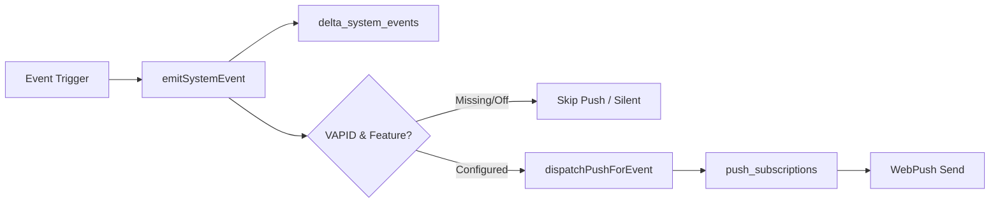

# DELTA 2018 GM — ETAP 11A: PUSH NOTIFICATIONS ARCHITECTURE & AUDIT REPORT

> **Status:** AUDIT & ARCHITECTURE COMPLETE (PUSH OFF)  
> **Target Release:** ETAP 11B  
> **Environment:** Production Supabase `fctgruvciakhohfxkdzp` (Untouched, PUSH OFF)

---

## 1. Current System Inventory

### Files
- **Service Worker:** `public/sw.js` (listens to `push` and `notificationclick`, target origin redirection).
- **Client Push Utilities:** `lib/push.ts` (manages permissions, registration, subscription payload generation, reset flow).
- **Event Emitter & Push Dispatcher:** `lib/events/emitter.ts` (records central events in `delta_system_events`, contains `dispatchPushForEvent`).
- **Event & Preference Types:** `lib/events/types.ts` (`SystemEventType`, `EventImportance`, `PushNotificationPreferences`).
- **Push Eligibility & Cutoff Logic:** `lib/events/push-eligibility.ts` (deterministic eligibility engine).
- **Frontend UI Modals:**
  - `components/DeltaNotificationCenterModal.tsx` (in-app notification feed).
  - `components/DeltaNotificationPreferencesModal.tsx` (user preference toggles).

### Tables
- `public.push_subscriptions` — stores browser subscription endpoints and user preferences.
- `public.delta_system_events` — central event ledger (13 active events in production).
- `public.delta_change_history` — field-level delta change history.
- `public.user_event_reads` — read/seen state tracking per user.
- `public.club_updates` — source items synced from DELTA website (10 records).
- `public.delta_sync_history` — DELTA sync run audit logs.

### API Routes
- `POST /api/push/subscribe` — registers or updates a user device push subscription.
- `POST /api/push/unsubscribe` — removes a subscription endpoint for the authenticated user.
- `GET /api/push/status` — verifies VAPID and DB readiness for the current user.
- `POST /api/push/send` — admin/coach manual push testing endpoint.
- `GET/POST /api/game/notifications` — in-app notifications read/unread management.

### Service Worker
- Active at `/sw.js` with scope `/`. Handles background push payloads and focuses or navigates client windows on click.

### Current Push Flow


---

## 2. Current Database Audit (`push_subscriptions`)

| Column | Type | Nullable | Default / Constraint | Purpose |
| :--- | :--- | :--- | :--- | :--- |
| `id` | `uuid` | NO | `gen_random_uuid()` PRIMARY KEY | Unique subscription row ID |
| `user_id` | `uuid` | NO | `REFERENCES profiles(id) ON DELETE CASCADE` | Owner user ID |
| `endpoint` | `text` | NO | `UNIQUE` | Unique browser push endpoint URL |
| `p256dh` | `text` | NO | - | Client public encryption key |
| `auth` | `text` | NO | - | Client authentication secret |
| `user_agent`| `text` | YES | - | Device / browser user agent info |
| `enabled` | `boolean` | NO | `TRUE` | Master toggle per device |
| `preferences`| `jsonb` | YES | `DEFAULT DEFAULT_PUSH_PREFERENCES` | Per-category user preferences |
| `last_used_at`| `timestamptz` | YES | `NOW()` | Timestamp of last push send |
| `created_at` | `timestamptz` | NO | `NOW()` | Subscription creation timestamp |

- **RLS Status:** ENABLED.
- **Policies:**
  - `push own select`: `user_id = auth.uid()`
  - `push own insert`: `user_id = auth.uid()`
  - `push own update`: `user_id = auth.uid()`
  - `push own delete`: `user_id = auth.uid()`
- **Server Role:** Server-side API uses service role client to manage and dispatch securely.

---

## 3. Event Source Audit (`delta_system_events`)

### Real Event Types Present in Code & DB:
1. `CLUB_NEWS` (10 items in production DB from DELTA Sync)
2. `MATCH_CREATED`
3. `MATCH_UPDATED`
4. `MATCH_CANCELLED`
5. `MATCH_RESULT_UPDATED` (1 item in production DB)
6. `TRAINING_CREATED`
7. `TRAINING_UPDATED`
8. `TRAINING_CANCELLED`
9. `LINEUP_PUBLISHED`
10. `GALLERY_CREATED`
11. `GALLERY_UPDATED`
12. `VIDEO_PUBLISHED`
13. `PLAYER_ACHIEVEMENT` (1 item in production DB)
14. `PLAYER_CARD_UNLOCKED`
15. `SYSTEM_MESSAGE`
16. `SYNC_ERROR` (1 item in production DB)

### Existing Importance Levels:
- `LOW` / `INFO` — Notification Center only.
- `NORMAL` — Standard push according to category preferences.
- `IMPORTANT` / `HIGH` — High priority push.
- `URGENT` / `CRITICAL` — Immediate critical alert.

### Existing Audience Types:
- `TEAM` — Broadcast to all team members.
- `USER` — Specific user account (`target_user_id`).
- `PLAYER` — Specific player/parent profile (`target_player_id`).
- `ADMIN` — Staff/Coaches only.

---

## 4. Backfill Safety — Critical Requirement

> [!CAUTION]
> After the recent DELTA Sync Hotfix, 10 `CLUB_NEWS` records exist in `delta_system_events`. When Web Push is enabled, **ZERO** historical events must trigger push notifications.

### Activation Cutoff Mechanism
1. Introduce a server-level configuration / env variable:
   `PUSH_ACTIVATION_CUTOFF_ISO` (e.g. `2026-10-09T18:00:00.000Z`).
2. Any event where `new Date(event.created_at) <= new Date(PUSH_ACTIVATION_CUTOFF_ISO)` is strictly marked **INELIGIBLE FOR PUSH** (`EVENT_PREDATES_ACTIVATION_CUTOFF`).
3. Only events created strictly after activation cutoff will be processed for push dispatch.

---

## 5. Push Eligibility Model (`isEventEligibleForPush`)

The decision engine in `lib/events/push-eligibility.ts` enforces the following checks:
```text
Event Dispatch Request
  │
  ├─ 1. Is PUSH_ENABLED == true? ── NO ──> REJECT (PUSH_FEATURE_DISABLED)
  ├─ 2. Is subscription.enabled == true? ── NO ──> REJECT (SUBSCRIPTION_DISABLED)
  ├─ 3. Is event.created_at > ACTIVATION_CUTOFF? ── NO ──> REJECT (EVENT_PREDATES_ACTIVATION_CUTOFF)
  ├─ 4. Is event age < TTL max age? ── NO ──> REJECT (EVENT_IS_STALE)
  ├─ 5. Is event.importance > LOW/INFO? ── NO ──> REJECT (IMPORTANCE_TOO_LOW_FOR_PUSH)
  ├─ 6. Does audience match user role/id? ── NO ──> REJECT (AUDIENCE_MISMATCH)
  ├─ 7. Is category preference ON in subscription? ── NO ──> REJECT (PREFERENCE_DISABLED)
  └─ ALL PASS ──> ELIGIBLE FOR DISPATCH
```

---

## 6. Exactly-Once Delivery & Deduplication Ledger

To ensure no user ever receives duplicate pushes for the same event, we propose the additive ledger table `push_deliveries`:

```sql
CREATE TABLE IF NOT EXISTS public.push_deliveries (
    id UUID PRIMARY KEY DEFAULT gen_random_uuid(),
    event_id TEXT NOT NULL,
    user_id UUID NOT NULL REFERENCES public.profiles(id) ON DELETE CASCADE,
    subscription_id UUID NOT NULL REFERENCES public.push_subscriptions(id) ON DELETE CASCADE,
    status TEXT NOT NULL DEFAULT 'PENDING',
    attempted_at TIMESTAMPTZ NOT NULL DEFAULT NOW(),
    delivered_at TIMESTAMPTZ,
    error_code INT,
    error_message TEXT,
    CONSTRAINT uq_push_delivery_event_sub UNIQUE(event_id, subscription_id)
);
```

---

## 7. Event Age / TTL & Stale Rules

| Event Type | Max Push Age (TTL) | Rationale |
| :--- | :--- | :--- |
| `CLUB_NEWS` | 120 minutes (2h) | Avoid notifying hours after sync |
| `MATCH_UPDATED` / `TRAINING_CANCELLED` | 360 minutes (6h) | Important schedule change |
| `MATCH_CREATED` / `TRAINING_CREATED` | 720 minutes (12h) | Advance schedule notification |
| `PLAYER_ACHIEVEMENT` / `CARD_UNLOCKED` | 60 minutes (1h) | Immediate gameplay reward |
| `GALLERY_CREATED` / `VIDEO_PUBLISHED` | 1440 minutes (24h) | Media update |
| *Default Fallback* | 180 minutes (3h) | Safe generic boundary |

*(Product Decision Required if different TTLs are preferred by club management).*

---

## 8. Push Preferences Mapping

| Preference Key | Covered System Events |
| :--- | :--- |
| `matches` | `MATCH_CREATED`, `MATCH_CANCELLED`, `MATCH_RESULT_UPDATED` |
| `schedule_changes` | `MATCH_UPDATED`, `TRAINING_UPDATED` |
| `trainings` | `TRAINING_CREATED`, `TRAINING_CANCELLED` |
| `lineup` | `LINEUP_PUBLISHED` |
| `achievements` | `PLAYER_ACHIEVEMENT` |
| `club_news` | `CLUB_NEWS` |
| `gallery` | `GALLERY_CREATED`, `GALLERY_UPDATED`, `VIDEO_PUBLISHED` |

---

## 9. Deep Links Mapping

- `CLUB_NEWS` ➔ `/dashboard?view=club`
- `MATCH_*` ➔ `/dashboard?view=matches`
- `TRAINING_*` ➔ `/dashboard?view=training`
- `PLAYER_ACHIEVEMENT` ➔ `/dashboard?view=achievements`
- `PLAYER_CARD_UNLOCKED` ➔ `/dashboard?view=collection`
- `GALLERY_*` / `VIDEO_*` ➔ `/dashboard?view=gallery`
- `SYSTEM_MESSAGE` ➔ `/dashboard`

---

## 10. Multi-Device & Dead Endpoint Handling

- **Multi-Device:** Enforced via `UNIQUE(endpoint)`. A single user ID can own multiple subscription rows (e.g. iPhone Safari PWA + Desktop Chrome).
- **Dead Endpoints:**
  - HTTP `404 Not Found` or `410 Gone` returned by WebPush provider triggers immediate automatic deletion from `push_subscriptions`.
  - Temporary errors (e.g. `429`, `5xx`, network timeout) are logged in `push_deliveries` with status `FAILED` without deleting the subscription.

---

## 11. Notification Storm & Throttling Protection

When DELTA Sync discovers multiple news items in a single run (e.g. 3–10 new posts):
1. The engine batches new items into a single digest push:
   - **Title:** `K.S. Delta Warszawa`
   - **Body:** `Opublikowano [N] nowych komunikatów na stronie klubu.`
   - **Deep Link:** `/dashboard?view=club`
2. Prevents users from receiving 10 rapid vibration alerts simultaneously.

---

## 12. VAPID Status Audit

- `VAPID_PUBLIC_KEY`: **MISSING**
- `VAPID_PRIVATE_KEY`: **MISSING**
- `VAPID_SUBJECT`: **PRESENT** (`mailto:kontakt@delta.warszawa.pl`)
- *Action for ETAP 11B:* Generate keypair using `web-push generate-vapid-keys` and configure in environment secrets.

---

## 13. Test Plan for ETAP 11B

- **TEST 1:** Historical event does not push (Backfill safety validated).
- **TEST 2:** New eligible event pushes once.
- **TEST 3:** Same event never pushes twice (Dedupe ledger guard).
- **TEST 4:** Disabled subscription generates zero push.
- **TEST 5:** Category preference OFF generates zero push.
- **TEST 6:** Wrong audience generates zero push.
- **TEST 7:** Dead endpoint (410/404) is deleted automatically.
- **TEST 8:** Multi-device sends once per active device.
- **TEST 9:** Notification click opens correct route.
- **TEST 10:** Push failure leaves event intact in Notification Center.
- **TEST 11:** Batching prevents notification storms.
- **TEST 12:** `PUSH_ENABLED=false` produces zero deliveries.
